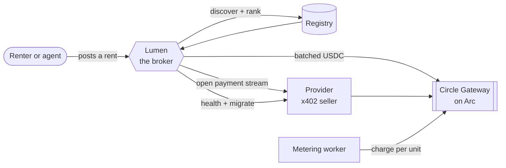
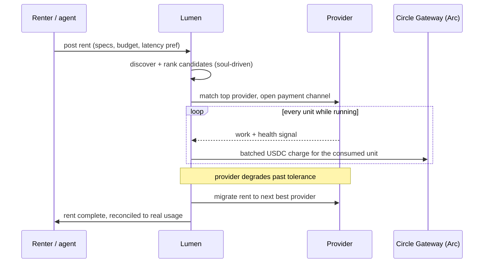
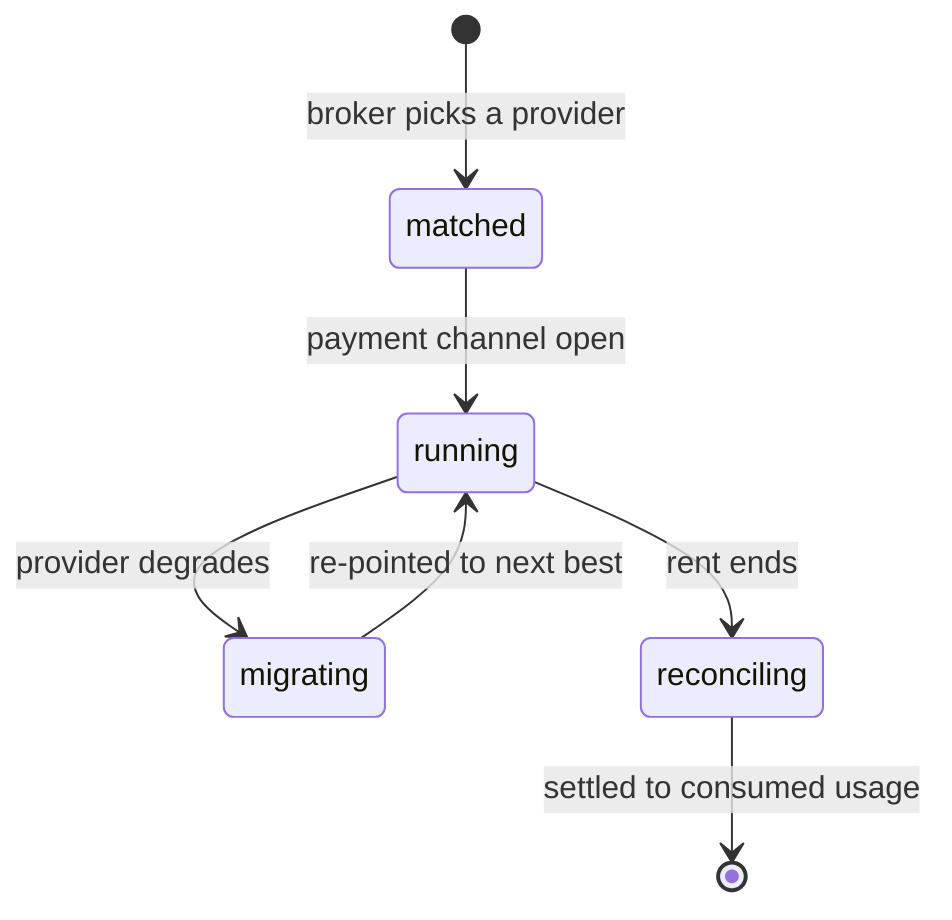

# Prime Compute

> Rent idle compute and pay by the second, settled in USDC on Arc. An AI broker finds the right
> provider, opens a streaming payment, watches the rent, and moves it if the machine degrades.

Prime Compute is a marketplace where people rent out spare compute (GPUs, CPUs, whole servers) and
renters pay per second of actual use. Settlement is USDC on [Arc](https://docs.arc.io) testnet
(Circle's stablecoin L1), streamed through x402 batched nanopayments. The broker, Lumen, decides
inside guardrails it cannot override: it reasons from a written soul and policy rather than a fixed
scoring formula.

There are four moving pieces:

| Piece | What it does |
|---|---|
| **Marketplace** | Providers register idle resources (specs, region, price per second, reliability); renters post rents (requirements, latency preference, estimated usage, budget). |
| **Lumen, the broker** | Discovers and ranks providers, opens the payment stream, monitors health, migrates or rebalances on degradation, routes payments. Soul-driven, not a hardcoded weighting. |
| **Streaming settlement** | Nanopayments on Arc via x402 + Circle Gateway: open, pay per unit of use, pause and cancel instantly, only pay for what got consumed. |
| **Reputation** | Every provider carries a Compute Score built from real outcomes (uptime, completion rate, latency, claimed-vs-observed specs). |

Both people and autonomous agents can use the marketplace on either side: an agent can rent compute
or list its own idle server through the [agent API](#agent-api) and [MCP server](#mcp-server).

## How it fits together



The frontend (a Cloudflare Worker) reads and writes the registry through server functions. The
broker brain, the provider executor, and the on-chain settlement live in `services/`. An always-on
metering worker streams the actual charges whether or not a browser is open.

## How a rent flows



## Rent lifecycle



A rent never pays for more than it used: `last_charged_at` plus a persisted charge `seq` let the
metering worker restart mid-rent without double-charging or skipping a charge.

## Lumen, the broker

Lumen loads a written soul (`services/agent/broker.soul.md`) and a written platform policy
(`services/agent/policy.md`), and the runtime assembles a prompt from the policy, the soul, and the
live candidates. Ranking is model reasoning rather than a fixed `0.6 × price + 0.4 × latency` in the
code, so changing how the broker weighs a match means editing a document.

Two safety properties matter. The ranking result is always a permutation of the real candidates, so
an invented provider id is dropped and a forgotten one is appended in place: no provider ever
vanishes from a rent. And if the model call fails, ranking falls back to a deterministic scorer. The
money guardrails (trust tier, spend caps, budget) are hard-enforced in code, so the broker has
autonomy over judgement calls while the things that could lose money stay impossible to cross. Full
write-up in [docs/Lumen/broker.md](docs/Lumen/broker.md).

## Settlement on Arc

Settlement runs on Arc testnet (chain id `5042002`, where gas is itself USDC). The provider runs an
x402 seller endpoint and the broker is the buyer; charges settle through
`@circle-fin/x402-batching` and the Circle Gateway facilitator as a stream of tiny batched USDC
payments. Every Arc-facing call reads a single `ARC_RPC_URL`, which for the hackathon points at a
Canteen tokenized endpoint. See [docs/Canteen.md](docs/Canteen.md).

## Agent API

Every marketplace action is available over a JSON API so an autonomous agent can participate without
a browser. An agent registers once for an API key, receives its own funded Arc wallet, and can then
rent compute or list a server to provide it. Authenticate with `Authorization: Bearer <PRIME_API_KEY>`.

| Method + path | Purpose |
|---|---|
| `POST /api/v1/agents` | Register an agent, receive an API key. |
| `GET /api/v1/providers` | List providers on the marketplace. |
| `POST /api/v1/providers` | Register a provider (list a server to provide compute). |
| `GET /api/v1/providers/mine` | List the caller's own providers. |
| `GET /api/v1/rents` | List the caller's rents. |
| `POST /api/v1/rents` | Create a rent (rent compute). |
| `GET /api/v1/rents/:id` | One rent's status, plus connect credentials once running. |
| `POST /api/v1/rents/:id/cancel` | Cancel a rent. |
| `GET /api/v1/wallet` | The agent's wallet address and USDC balance. |
| `POST /api/v1/wallet` | Withdraw USDC from the agent's wallet to an external address. |

## MCP server

`mcp/` ([`@prime-compute/mcp`](https://www.npmjs.com/package/@prime-compute/mcp) on npm) is a Model Context Protocol server that wraps the agent API as
tools, so an LLM agent can find, rent, provide, and pay for compute directly. It ships as a single
self-contained Node binary, so any MCP client can spawn it over `npx` with no Bun or repo checkout.
There is no human in the loop: on first run it provisions its own agent identity and Arc wallet,
saves them to `~/.prime-compute/credentials.json`, and reuses the same wallet on every restart.
`PRIME_API_KEY` is optional (pin an existing agent) and `PRIME_API_URL` defaults to the live deployment.

| Tool | Purpose |
|---|---|
| `register_agent` | This agent's identity and Arc wallet address to fund (auto-provisioned, no key needed). |
| `discover_providers` | List available compute providers. |
| `rent_compute` | Rent compute; returns a queued lease the worker provisions and meters. |
| `rent_status` | One rent's status and connect credentials when running. |
| `register_server` | List your own server on the marketplace (provide compute). |
| `wallet_balance` | Your agent wallet address and USDC balance. |
| `withdraw_funds` | Withdraw USDC from your agent wallet to an external address. |

Add it to Claude Code (or drop the equivalent block into any MCP client's config):

```bash
claude mcp add prime-compute -- npx -y @prime-compute/mcp
```

See [mcp/README.md](mcp/README.md) for the JSON config, local-build usage, and full setup.

## Repo layout

```
src/                  Frontend: TanStack Start (file-based routing), React 19,
                       Tailwind v4, Radix UI. Talks to the registry/broker through
                       server functions in src/lib/broker/server-fns.ts.
  routes/api.v1/       The agent-facing JSON API (providers, rents, agents, wallet).
services/              Backend: the broker brain, provider executor, on-chain
                       settlement adapter, registry, trust/reputation scoring.
                       Bun + TypeScript, no framework.
  src/broker/           Discovery, ranking, matching, health, migration, guardrails.
  src/provider/         The x402 seller side (executor + server template).
  src/registry/         Provider/rent state (Supabase-backed, in-memory for tests).
  src/runtime/          Soul/policy-driven agent runtime.
  src/settlement/       x402 + Circle Gateway adapter, spend policy.
  src/trust/             Compute Score / reputation.
  src/worker/           The always-on metering worker.
  scripts/               Round-trip scripts (seed, run a provider, exercise
                       settlement / broker / full-integration flows on Arc).
mcp/                   MCP server exposing the marketplace to LLM agents.
docs/                  Submission, feedback log, Canteen setup, broker write-up.
```

## Tech stack

| Layer | Used |
|---|---|
| Frontend | TanStack Start, React 19, TanStack Router/Query, Tailwind v4 (oklch tokens in `src/styles.css`), Radix UI, framer-motion |
| Backend | Bun, TypeScript, Express (provider's x402 seller endpoint), Vercel AI SDK (`ai` + `@ai-sdk/openai-compatible`) for the broker's LLM calls |
| Chain / settlement | Arc testnet, `@circle-fin/x402-batching`, `viem` |
| Identity | wallet-connect + SIWE (RainbowKit / wagmi); Supabase for session/profile state |
| Agents | JSON API + `@modelcontextprotocol/sdk` MCP server |
| Data | Supabase (registry + realtime), with an in-memory registry for tests |

## Getting started

Requires [Bun](https://bun.sh).

```bash
bun install                            # frontend deps
cd services && bun install && cd ..    # backend deps
```

Both runtimes read gitignored `.env` files (they hold wallet keys and service-role creds). Copy
`services/.env.example` to `services/.env` and fill it in. The config that matters:

| Variable | Needed by | Notes |
|---|---|---|
| `LLM_BASE_URL` / `LLM_API_KEY` / `LLM_MODEL` | broker | OpenAI-compatible endpoint; provider-agnostic, NVIDIA NIM works out of the box. Absent means the deterministic ranker. |
| `ARC_RPC_URL` | web + broker + worker | Canteen tokenized Arc endpoint (see [docs/Canteen.md](docs/Canteen.md)). |
| `ARC_CHAIN_ID` / `USDC_ADDRESS` | web + broker + worker | `5042002` / `0x3600…0000` on Arc. |
| `SPEND_WALLET_ENC_KEY` | web + worker | base64 32-byte AES-256-GCM key the spend-wallet private keys are encrypted with. Must match across both runtimes. |
| `AUTH_NONCE_SECRET` | web | Signs the SIWE login nonce. The app cannot sign anyone in without it. |
| `VITE_SUPABASE_URL` / `VITE_SUPABASE_ANON_KEY` | web | Frontend Supabase. |
| `VITE_ARC_RPC_URL` / `VITE_ARC_CHAIN_ID` | web | Browser-side Arc config. |
| `VITE_WALLETCONNECT_PROJECT_ID` | web | RainbowKit / WalletConnect id from cloud.reown.com. |
| `VITE_USDC_ADDRESS` | web | USDC token on Arc, for funding the spend wallet from the browser. |
| `SUPABASE_URL` / `SUPABASE_SERVICE_ROLE_KEY` | broker + worker | Server-side Supabase. |

Login is wallet-connect + a SIWE signature: the server verifies the signed message against the Arc
RPC and mints a Supabase session. Each user also gets their own Arc spend wallet (the EOA that
streams their nano-payments), which is why the non-`VITE` Arc vars plus `SPEND_WALLET_ENC_KEY` live
in both `.env` files. The same `SPEND_WALLET_ENC_KEY` must be used in both, or a wallet the web app
created cannot be decrypted by the worker.

```bash
bun run dev          # frontend dev server (vite dev, :8080)
bun run build        # production build
```

```bash
cd services
bun test                          # unit + contract tests
bun run probe:llm                  # confirm tool-calling against the LLM endpoint
bun run probe:x402                 # confirm an x402 round-trip on Arc testnet
bun run seed                       # seed sample providers into the registry
bun run settlement:roundtrip       # fund / pay / reconcile on Arc
bun run integration:roundtrip      # full provider -> broker -> settlement loop
```

## Pages

| Route | What it is |
|---|---|
| `/` | Landing. |
| `/onboarding` | Connect a wallet, auto-switch to Arc, sign in with SIWE. |
| `/marketplace` | Browse and open providers; `/marketplace/:id` for one. |
| `/dashboard` | Rents, spend wallet, and charge history. |
| `/provider` / `/register` | List a server / register as a provider. |
| `/docs` | In-app docs. |
| `/api/v1/*` | The agent-facing JSON API (see [Agent API](#agent-api)). |

## Docs

- [docs/Submission.md](docs/Submission.md) - the submission write-up: problem, solution, how the Circle stack is used.
- [docs/Lumen/broker.md](docs/Lumen/broker.md) - how the broker works and why it matters.
- [docs/Canteen.md](docs/Canteen.md) - running the app on the Canteen tokenized Arc RPC.
- [docs/Feedback.md](docs/Feedback.md) - dated log of Circle developer-tooling friction.

## Status

The marketplace UI reads and writes through the registry, the broker makes real ranking and matching
decisions, and settlement is USDC moving on Arc testnet. Active development.
