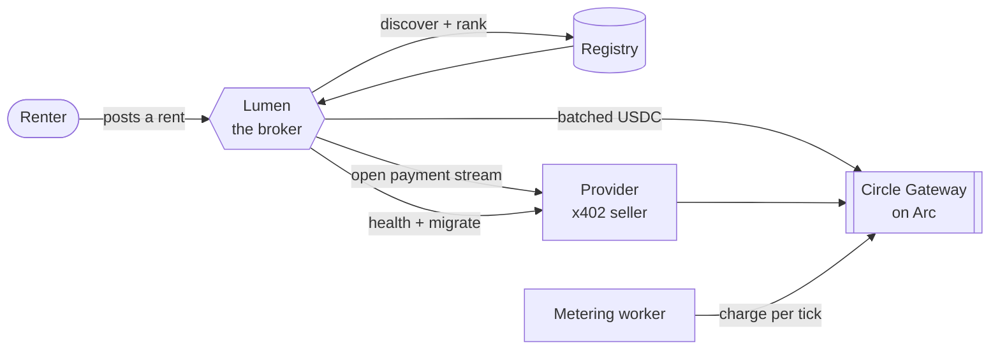
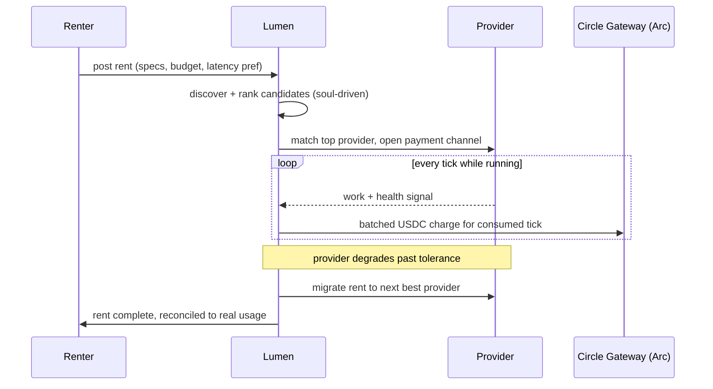
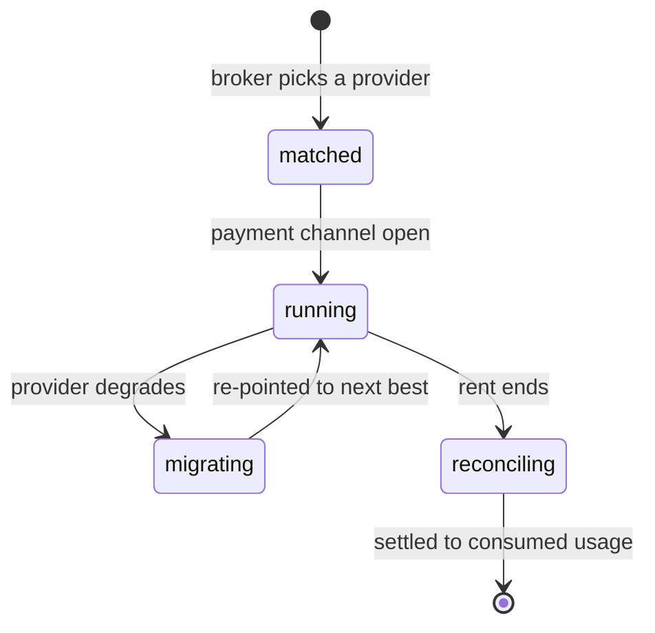

# Prime Compute

> Rent idle compute and pay by the second, settled in real USDC on Arc. An AI broker does the
> hard part: it finds the right provider, opens a streaming payment, watches the rent, and moves
> it if the machine goes bad. Renting a GPU should feel like turning on a tap, not signing a lease.

Prime Compute is a marketplace where people rent out spare compute (GPUs, CPUs, whole servers) and
renters pay per second of actual use. The money is real: settlement is USDC on
[Arc](https://docs.arc.io) testnet (Circle's stablecoin L1), streamed through x402 batched
nanopayments, not simulated. The thing that makes it work day to day is Lumen, the AI broker, which
genuinely decides inside guardrails it can't override rather than running a script with extra steps.

There are four moving pieces:

| Piece | What it does |
|---|---|
| **Marketplace** | Providers register idle resources (specs, region, price per tick, reliability); renters post rents (requirements, latency preference, estimated usage, budget). |
| **Lumen, the broker** | Discovers and ranks providers, opens the payment stream, monitors health, migrates or rebalances on degradation, routes payments. Soul-driven, not hardcoded. |
| **Streaming settlement** | Nanopayments on Arc via x402 + Circle Gateway: open, pay per tick, pause and cancel instantly, only ever pay for what got consumed. |
| **Reputation** | Every provider carries a Compute Score built from real outcomes (uptime, completion rate, latency, claimed-vs-observed specs), not a vanity number. |

## How it fits together



The frontend (a Cloudflare Worker) reads and writes the registry through server functions. The
broker brain, the provider executor, and the on-chain settlement live in `services/`. An always-on
metering worker streams the actual charges whether or not anyone's browser is open.

## How a rent flows



## Rent lifecycle



A rent never pays for more than it used: `last_charged_at` plus a persisted charge `seq` mean the
metering worker can restart mid-rent and never double-charge or skip a tick.

## Lumen, the broker

Lumen is the part I care about most. It loads a written soul (`services/agent/broker.soul.md`) and a
written platform policy (`services/agent/policy.md`), and the runtime assembles a prompt from the
policy, the soul, and the live candidates. The ranking is real model reasoning, not a hardcoded
`0.6 × price + 0.4 × latency` buried in the code, so changing how Lumen thinks means editing a
document, not the ranker.

Two safety properties matter. The ranking result is always a permutation of the real candidates, so
an invented provider id gets dropped and a forgotten one gets appended in place: no provider ever
silently vanishes from a rent. And if the model call fails, ranking degrades to a deterministic
scorer instead of throwing. The money guardrails (trust tier, spend caps, budget) are hard-enforced
in code, so Lumen gets real autonomy over judgement calls while the things that could lose someone
money stay impossible to cross. Full write-up in [docs/Lumen/broker.md](docs/Lumen/broker.md).

## Settlement on Arc

Settlement is genuinely on-chain on Arc testnet (chain id `5042002`, where gas is itself USDC). The
provider runs an x402 seller endpoint and the broker is the buyer; charges settle through
`@circle-fin/x402-batching` and the Circle Gateway facilitator as a stream of tiny batched USDC
payments. Every Arc-facing call reads a single `ARC_RPC_URL`, which for the hackathon points at a
Canteen tokenized endpoint. See [docs/Canteen.md](docs/Canteen.md).

## Repo layout

```
src/                  Frontend: TanStack Start (file-based routing), React 19,
                       Tailwind v4, Radix UI. Talks to the registry/broker through
                       server functions in src/lib/broker/server-fns.ts.
services/              Backend: the broker brain, provider executor, on-chain
                       settlement adapter, registry, trust/reputation scoring.
                       Bun + TypeScript, no framework.
  src/broker/           Discovery, ranking, matching, health, migration, guardrails.
  src/provider/         The x402 seller side (executor + server template).
  src/registry/         Provider/rent state (Supabase-backed, in-memory for tests).
  src/runtime/          Soul/policy-driven agent runtime (reasons from SOUL/POLICY,
                       not hardcoded branching).
  src/settlement/       x402 + Circle Gateway adapter, spend policy.
  src/trust/             Compute Score / reputation.
  src/worker/           The always-on metering worker.
  scripts/               Round-trip scripts (seed, run a provider, exercise
                       settlement / broker / full-integration flows on Arc).
  probes/                One-off capability probes (LLM tool-calling, x402
                       round-trip, soul-driven ranking).
docs/                  Submission, feedback log, Canteen setup, broker write-up,
                       worker deploy.
```

## Tech stack

| Layer | What I used |
|---|---|
| Frontend | TanStack Start, React 19, TanStack Router/Query, Tailwind v4 (oklch tokens in `src/styles.css`), Radix UI, framer-motion |
| Backend | Bun, TypeScript, Express (provider's x402 seller endpoint), Vercel AI SDK (`ai` + `@ai-sdk/openai-compatible`) for the broker's LLM calls |
| Chain / settlement | Arc testnet, `@circle-fin/x402-batching`, `viem` |
| Identity | wallet-connect + SIWE (RainbowKit / wagmi), the connected address is the identity anchor; Supabase for session/profile state |
| Data | Supabase (registry + realtime), with an in-memory registry for tests |

## Getting started

Requires [Bun](https://bun.sh).

```bash
bun install                            # frontend deps
cd services && bun install && cd ..    # backend deps
```

Both runtimes read gitignored `.env` files (they hold wallet keys and service-role creds). Copy
`services/.env.example` to `services/.env` and fill it in. The config that matters:

| Variable | Needed by | Notes |
|---|---|---|
| `LLM_BASE_URL` / `LLM_API_KEY` / `LLM_MODEL` | broker | OpenAI-compatible endpoint; the brain is provider-agnostic, NVIDIA NIM works out of the box. Absent = deterministic ranker. |
| `ARC_RPC_URL` | web + broker + worker | Your Canteen tokenized Arc endpoint (see [docs/Canteen.md](docs/Canteen.md)). |
| `ARC_CHAIN_ID` / `USDC_ADDRESS` | web + broker + worker | `5042002` / `0x3600…0000` on Arc. |
| `SPEND_WALLET_ENC_KEY` | web + worker | base64 32-byte AES-256-GCM key the spend-wallet private keys are encrypted with. Must match across both runtimes. |
| `AUTH_NONCE_SECRET` | web | Signs the SIWE login nonce. **The app can't sign anyone in without it.** |
| `VITE_SUPABASE_URL` / `VITE_SUPABASE_ANON_KEY` | web | Frontend Supabase. |
| `VITE_ARC_RPC_URL` / `VITE_ARC_CHAIN_ID` | web | Browser-side Arc config. |
| `VITE_WALLETCONNECT_PROJECT_ID` | web | RainbowKit / WalletConnect id from cloud.reown.com. |
| `VITE_USDC_ADDRESS` | web | USDC token on Arc, for funding the spend wallet from the browser. |
| `SUPABASE_URL` / `SUPABASE_SERVICE_ROLE_KEY` | broker + worker | Server-side Supabase. |

Login is wallet-connect + a SIWE signature: the server verifies the signed message against the Arc
RPC and mints a Supabase session. Each user also gets their own Arc spend wallet (the EOA that
streams their nano-payments), which is why the non-`VITE` Arc vars plus `SPEND_WALLET_ENC_KEY` live
in both `.env` files. Use the same `SPEND_WALLET_ENC_KEY` in both, or a wallet the web app created
can't be decrypted by the worker.

```bash
bun run dev          # frontend dev server (vite dev, :8080)
bun run build        # production build
```

```bash
cd services
bun test                          # unit + contract tests
bun run probe:llm                  # confirm tool-calling against your LLM endpoint
bun run probe:x402                 # confirm an x402 round-trip on Arc testnet
bun run seed                       # seed sample providers into the registry
bun run settlement:roundtrip       # fund / pay / reconcile on Arc
bun run integration:roundtrip      # full provider -> broker -> settlement loop
```

## Pages

| Route | What it is |
|---|---|
| `/` | Landing. |
| `/onboarding` | Connect a wallet, auto-switch to Arc, sign in with SIWE. |
| `/marketplace` | Browse and open providers; `/marketplace/:id` for one. |
| `/dashboard` | Your rents, spend wallet, and charge history. |
| `/provider` / `/register` | List a server / register as a provider. |
| `/docs` | In-app docs. |
| `/api/v1/*` | JSON API for providers, rents, agents, wallet. |

## Docs

- [docs/Submission.md](docs/Submission.md) — the submission write-up: problem, solution, how the Circle stack is used.
- [docs/Lumen/broker.md](docs/Lumen/broker.md) — how the broker actually works and why it matters.
- [docs/Canteen.md](docs/Canteen.md) — running the app on the Canteen tokenized Arc RPC.
- [docs/Feedback.md](docs/Feedback.md) — my dated log of Circle developer-tooling friction.
- [docs/WORKER_DEPLOY.md](docs/WORKER_DEPLOY.md) — deploying the always-on metering worker.

## Status

This is a real infrastructure build, not a mockup. The marketplace UI reads and writes through the
registry, the broker makes real ranking and matching decisions, and settlement is real USDC moving
on Arc testnet. Active development; `docs/superpowers/plans/` has the sequence of work it was built
in.
